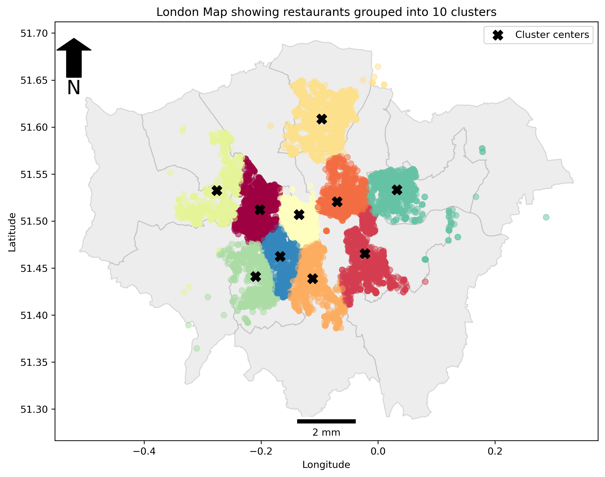
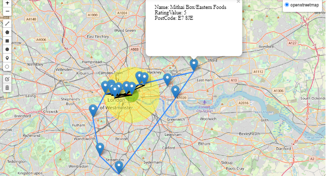
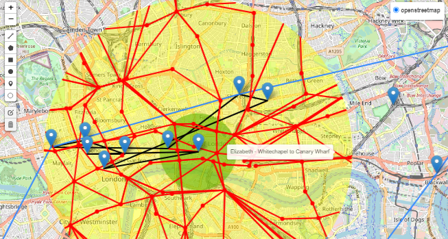

# ldn-restaurants-geospatial-analysis
For london restaurant data obtained from the [wyre data api](https://wyre-data.p.rapidapi.com/restaurants/town/london), cluster and buffer analyses, calculation of distances between points of interest and interactive folium maps were made in order to understand the data better

### Analyses
#### 1. Cluster Anlysis
The elbow method was used to find the appropriate value of k to be used for clustering.

The `MiniBatchKMeans` function in sklearn was used to make the clusters and this was done to further group the restaurant points in the event that further analysis needed to be done in smaller areas.

#### 2. Buffer Analysis
Name of a restaurant is taken as input from the user and buffers(depending values of interest to the user) are drawn(with different colours) around a restaurant of interest, to see all other restaurants which fall within the preferred region and all others which fall outside. 

### Functions Written
Function name          |Arguments                   |Description                     |Ouptut
-----------------------|----------------------------|------------------------------- |-------------------
`create_linestring_gdf`|gdframe, epsg=27700	    |Creates a line gdf* from a point gdf      |Line gdf              
`calc_dist_bw_pts_in`    |gdframe, epsg               |Converts points to a projected epsg(whose code the user must enter) before calculation of distances between all points in the gdframe                |Geodataframe with a new `distances` column
`add_markers_to_the_map` |gdframe, epsg=27700         |Converts points to epsg 27700 if chosen by user and adds point markers in gdf to folium map                |Folium map object
`add_lines_to`           |map_object, line_gdf, color |Plots lines in a line gdf on a folium map object  |Folium map object

### Visualizations
Visualizations were made with the help of `folium`, `geopandas` and `matplotlib` modules. For `foliup` maps, popups and tooltips are added for interactivity
#### Visualizations made
- Restuarants of interest [`shown blue markers`]
- Buffer regions [`shown by yellow and green circle areas`]
- Convex hull around restaurants of interest [`shown blue polygon`]
- Distances between restaurants within the buffer regions and their respective tooltips [`shown by black lines`]
- London tube stations within buffer regions and their respective tooltips [`shown by red points`]
- London tube lines within buffer regions and their respective tooltips [`shown by red lines`]

### Data Sources
 File name                                 |Data type                        |Source                              |Component
------------------------------------------ |---------------------------------|----------------------------------- |--------------
english_region_region.shp                  |Spatial                          |[data.gov.co.uk](https://www.data.gov.uk/dataset/d310b2c5-5253-4bc2-a78d-f8240293119d/boundary-line)                    |Shapefile(.shp, .dbf, .prj, .shx)
greater_london_const_region.shp            |Spatial                          |[data.gov.co.uk](https://www.data.gov.uk/dataset/d310b2c5-5253-4bc2-a78d-f8240293119d/boundary-line)                    |Shapefile(.shp, .dbf, .prj, .shx)
london_tube_stations.kml                   |Spatial                          |[doogal.co.uk](https://www.doogal.co.uk/london_stations)  |kml
London_Train_Lines.kml                     |Spatial                          |[doogal.co.uk](https://www.doogal.co.uk/london_stations)  |kml
bus-stops-example.csv                      |Non-spatial                      |[tfl.gov.uk](https://tfl.gov.uk/info-for/open-data-users/our-open-data)                           |Csv file(with the following columns: `Stop_Code_LBSL`	`Bus_Stop_Code`	`Naptan_Atco`	`Stop_Name`	`Location_Easting`	`Location_Northing`	`Heading`	`Stop_Area`	`Virtual_Bus_Stop`
rdata.csv                                  |Non-spatial                      |[wyre data api](https://wyre-data.p.rapidapi.com/restaurants/town/london)                           |Csv file(with the following columns:  `_id`	`BusinessName`	`RatingValue`	`AddressLine2`	`PostCode`	`Geocode_Longitude`	`Geocode_Latitude`)
London_tube_lines.csv                      | Non-spatial                     |[doogal.co.uk](https://www.doogal.co.uk/london_stations)|Csv file(with the following columns:  `Tube Line`	`From Station`	`To Station`

	
### To-do:
Add error handling functionality to functions

Feature groups for imrpoved legend on folium plot

### *
*gdf- geodataframe
